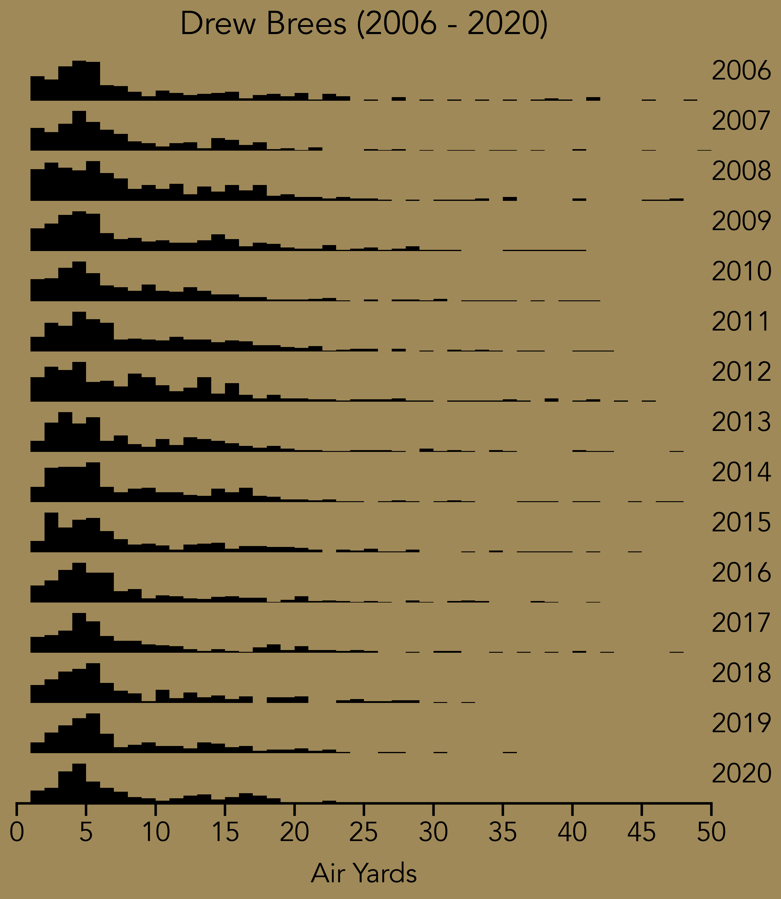
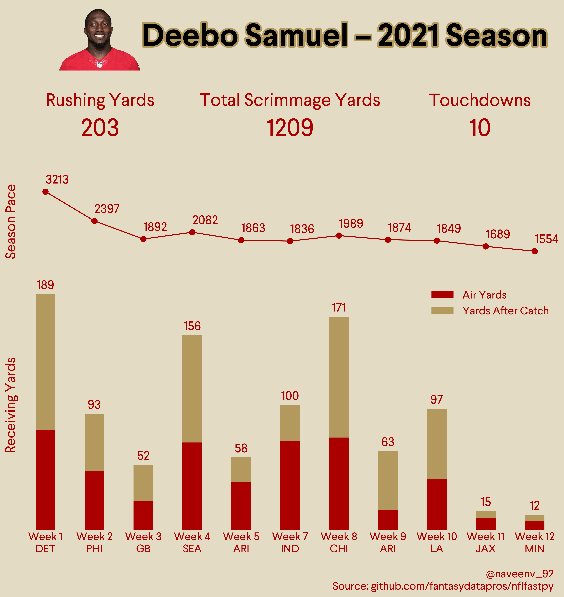
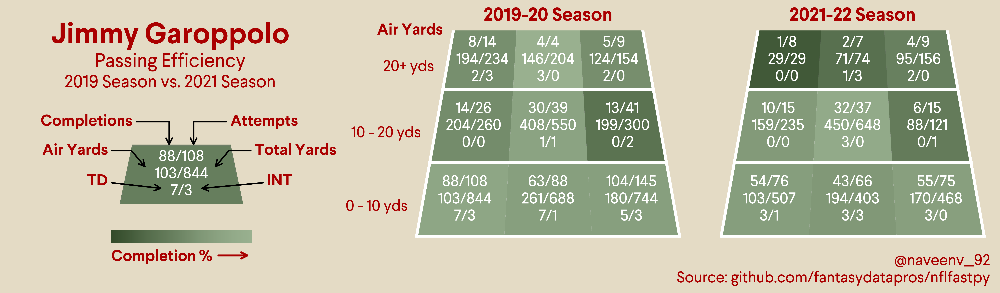

# NFL Infographics
@venkatesannaveen  
Create using [matplotlib](https://github.com/matplotlib/matplotlib) and [nflfastpy](https://github.com/fantasydatapros/nflfastpy)  

### Table of Contents  
1. [Drew Brees Career Air Yards](#drew-brees-career-air-yards)  
2. [Deebo Samuel 2021-22 Season](#deebo-samuel-2021-22-season)  
3. [Jimmy Garoppolo 2019 vs. 2021 Passing Efficiency](#jimmy-garoppolo-2019-2021-passing)

### Infographics

#### Drew Brees Career Air Yards

  

#### Deebo Samuel 2021-22 Season

  

#### Jimmy Garoppolo 2019 vs. 2021 Passing Efficiency  

