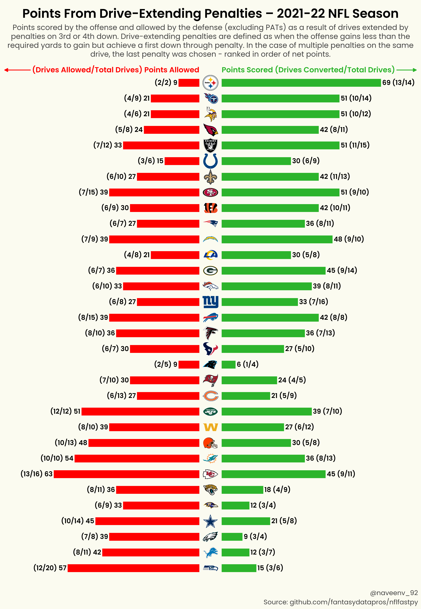

# NFL Infographics
@venkatesannaveen  
Create using [matplotlib](https://github.com/matplotlib/matplotlib) and [nflfastpy](https://github.com/fantasydatapros/nflfastpy)  

### Table of Contents  
1. [Drew Brees Career Air Yards](#drew-brees-career-air-yards)  
2. [Deebo Samuel 2021-22 Season](#deebo-samuel-2021-22-season)  
3. [Jimmy Garoppolo 2019 vs. 2021 Passing Efficiency](#jimmy-garoppolo-2019-vs-2021-passing-efficiency)
4. [Points From Drive-Extending Penalties](#points-from-drive-extending-penalties)
5. [Best (and Worst) Second Half Performers](#best-and-worst-second-half-performers)

### Infographics

<h3 align="center">Drew Brees Career Air Yards</h3>

  

<h3 align="center">Deebo Samuel 2021-22 Season</h3>

  

<h3 align="center">Jimmy Garoppolo 2019 vs. 2021 Passing Efficiency</h3>  

  

<h3 align="center">Points From Drive-Extending Penalties</h3>  

  

<h3 align="center">Best (and Worst) Second Half Performers</h3>  

